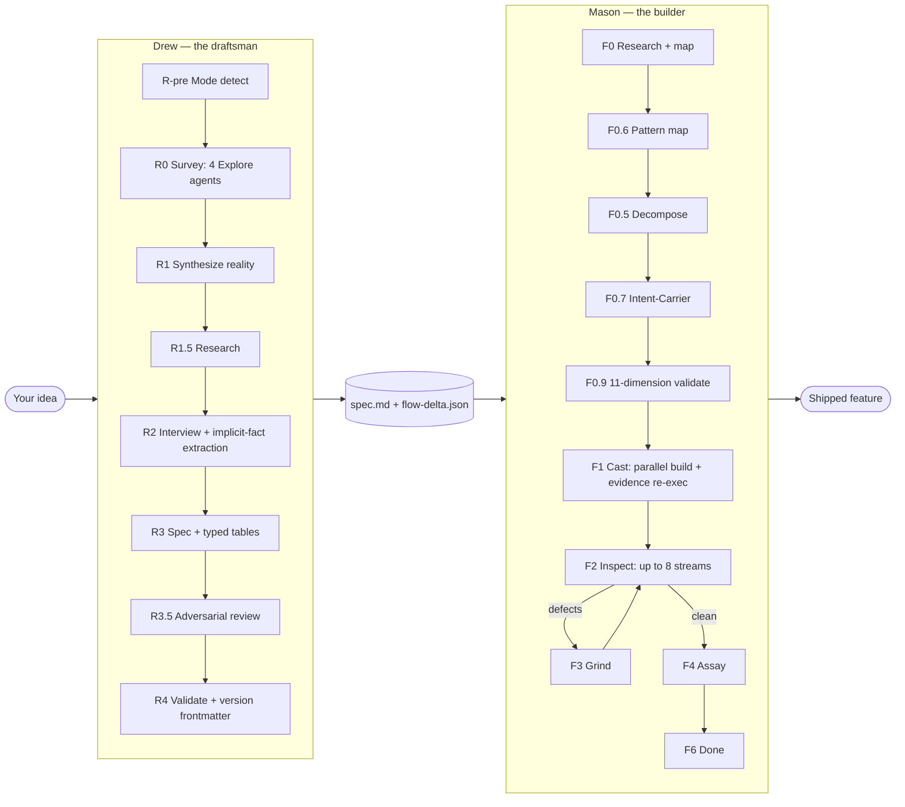
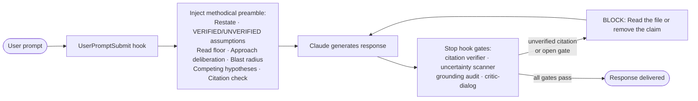

<div align="center">


[](LICENSE)
[](#-the-crew)
[](https://docs.claude.com/en/docs/claude-code)
[](CONTRIBUTING.md)
[](https://github.com/gshepptech/bits-and-mortar/commits/main)
[](https://github.com/gshepptech/bits-and-mortar/stargazers)

<br/>

**A crew of AI builders for Claude Code.**
*Drew draws it. Mason builds it. Bob keeps Claude honest. You ship.*

[Install](#-install) · [The Crew](#-the-crew) · [Which one do I need?](#-which-crew-member-do-i-need) · [How they work together](#-how-they-work-together) · [Contributing](#-contributing)

</div>

---

> [!NOTE]
> **Bits & Mortar** is a [Claude Code](https://docs.claude.com/en/docs/claude-code) plugin marketplace. Hire the whole crew for a job or call one tradesperson when you need them: a draftsman who specs your codebase, a builder who builds it autonomously, an always-on hand who keeps the work true — plus a cleanup crew, an inspector, an orchestrator, and a design reviewer. The spec survives the trip. The citations get verified. The code ships.

## 📑 Contents

- [Install](#-install)
- [The Crew](#-the-crew)
- [Which crew member do I need?](#-which-crew-member-do-i-need)
- [How they work together](#-how-they-work-together)
- [Per-plugin docs](#-per-plugin-docs)
- [Contributing](#-contributing)
- [License](#-license)

---

## 🚀 Install

```bash
# In Claude Code: add the marketplace
/plugin marketplace add gshepptech/bits-and-mortar

# Hire the core trio
/plugin install drew@bits-and-mortar
/plugin install mason@bits-and-mortar
/plugin install bob@bits-and-mortar

# ...and the rest of the crew, as you need them
/plugin install gus@bits-and-mortar
/plugin install dusty@bits-and-mortar
/plugin install tess@bits-and-mortar
/plugin install riggs@bits-and-mortar
/plugin install marlowe@bits-and-mortar
```

> [!TIP]
> Bob clocks in immediately — every new conversation runs the methodical preamble plus the Stop-hook gates by default. `/bob:status` to inspect, `/bob:casual` to skip a trivial turn, `/bob:off` to silence the session.

Then, from inside your project:

```bash
# Drew interviews you and writes a locked spec
/drew:plan "add a workloads page that lists running pods with status and logs"

# Mason takes the spec and builds it — autonomously, to F6 DONE
/mason:start lathe --spec docs/specs/workloads-page/spec.md
```

---

## 👷 The Crew

| Who | Trade | Key commands |
|---|---|---|
| **Drew** `v5.0.0` | The draftsman — codebase-aware spec engine; a grounded interview that yields a locked, classified, Mason-ready spec | `/drew:plan`, `/drew:resume`, `/drew:cleanup` |
| **Mason** `v4.4.0` | The builder — autonomous build-verify-fix loop; decompose, validate, build in waves, inspect, grind, assay | `/mason:setup`, `/mason:start`, `/mason:status`, `/mason:stop`, `/mason:resume` |
| **Bob** `v0.5.0` | Keeps the work plumb — methodical-mode guardrails; a pre-response checklist + Stop-hook gates on every ad-hoc turn | `/bob:on`, `/bob:off`, `/bob:casual`, `/bob:trust-me`, `/bob:status` |
| **Gus** `v0.2.0` | The GC — a multi-agent crew that owns an outcome; investigate, plan, execute, verify | `/gus:do`, `/gus:goal`, `/gus:list`, `/gus:resume`, `/gus:cancel` |
| **Dusty** `v0.1.0` | The sweep — careful low-risk cleanup across 7 focused tracks, auto-applying only HIGH-confidence changes | `/dusty:run`, `/dusty:apply`, `/dusty:status` |
| **Tess** `v0.2.0` | The inspector — end-to-end Playwright test authoring and maintenance via Playwright MCP | `/tess:init`, `/tess:write`, `/tess:crawl`, `/tess:matrix`, `/tess:audit`, `/tess:record` |
| **Riggs** `v0.2.0` | The rigger — on-demand generator of self-contained Workflow orchestration scripts | `/riggs:make` |
| **Marlowe** `v0.1.0` | The surveyor — macro-architecture / design-cohesion review; is this shaped right, or accreted? | `/marlowe:review` |

**Drew draws it. Mason builds it.** The rest of the crew covers the work around the edges.

<details>
<summary><b>📋 Meet each tradesperson (click to expand the full job description)</b></summary>

### 📐 Drew — the draftsman
Codebase-aware specification engine. Runs parallel codebase research, then a grounded interview that captures implicit facts as `A-AUTO-NNN` entries, emits typed **Global Invariants / State Transitions / Contracts** tables, runs an adversarial spec review at R3.5, then writes a Mason-ready spec with version frontmatter — locked, classified, citation-backed. Detects brownfield, greenfield, and cosmetic modes; brownfield runs produce a flow delta against the existing system. *Drew plans. Mason builds.*

### 🧱 Mason — the builder
Autonomous build-verify-fix loop. Reads Drew's spec, decomposes it into castings with pre-authored teammate prompts, validates through an 11-dimension gate (including intent-carrier coverage), builds in parallel waves with server-side evidence re-execution and per-requirement-ID binding, runs up to **8 verification streams** (TRACE, FLOW_TRACE, PROVE, RESEARCH_AUDIT, COVERAGE_DIFF, SIGHT, TEST/PROBE, TEST_OBSERVATIONS), grinds defects to zero, then assays with fresh eyes.

### 📏 Bob — keeps the work plumb
Methodical-mode discipline: *measure twice, cut once.* Injects a pre-response checklist every turn (Restate, Verified/Unverified assumptions, Read Floor, Blast Radius, Competing Hypotheses, and more). A Stop hook enforces five gates: a `file:line` citation verifier, an uncertainty-tell scanner, a completion gate, a zero-tool-call grounding audit, and an iterative two-tier critic-dialog. `/bob:casual`, `/bob:trust-me`, `/bob:off` when you need to step around it.

### 🏗️ Gus — the general contractor
Hand Gus a gnarly problem and he owns the outcome end to end. Runs a crew of five sub-agents (dispatcher, recon, builder, auditor, fresh-eyes) to investigate, plan, execute, and verify — SSH into systems, spin up infra, edit code, ship features, debug deploys. Bounded recon budget, multi-angle retry on stuck, and evidence ledgers from the auditor and fresh-eyes. `/gus:goal` runs the loop unattended until both verifiers pass.

### 🧹 Dusty — the sweep
Careful, low-risk codebase cleanup across **7 focused tracks**: deduplication, type consolidation, dead code removal, circular-dependency untangling, type strengthening, error-handling cleanup, and deprecated/AI-slop removal. Auto-applies **only** HIGH-confidence LOW-risk changes per batch, running type checks, tests, and lints after each. Atomic commits, so any failing check is one `git revert` away.

### 🔍 Tess — the inspector
End-to-end test authoring and maintenance via Playwright + Playwright MCP. Drives a real browser, reads the accessibility tree, and emits `*.spec.ts` files that pass — then keeps them passing. `/tess:crawl` discovers every route; `/tess:matrix` builds a routes × roles suite; `/tess:audit` triages failures from `trace.zip` by root cause. Enforces selector hygiene (`getByRole` over CSS) and auto-wait discipline.

### 🔧 Riggs — the rigger
Generates really good dynamic **Workflow** scripts on demand. `/riggs:make <task>` classifies the task into an orchestration archetype, picks the right fan-out topology (pipeline by default, barrier only when a stage needs all prior results), and authors a self-contained, `node --check`-validated Workflow script — schema'd agent returns, `.filter(Boolean)` after fan-out, adversarial-verify for findings, loop-until-dry for unknown-size work.

### 🕵️ Marlowe — the surveyor
Macro-architecture / design-cohesion review — the senior-engineer *"is this shaped right or accreted?"* critique, not bug-hunting or lint. `/marlowe:review <target>` runs **8 blind design lenses** (proliferation, missed reuse, helper sprawl, layering, cohesion, naming, accretion markers, boundary direction), each a separate agent. Findings are adversarially cross-examined by a skeptic, then synthesized into a per-subsystem *deliberate / mixed / accreted* verdict with `file:line` evidence and a concrete reshaping plan. Report only — never edits code.

</details>

---

## 🧭 Which crew member do I need?

| If you want to… | Call | Pairs well with |
|---|---|---|
| Turn a vague idea into a locked, buildable spec | **Drew** | → Mason |
| Build a spec out autonomously, verified | **Mason** | ← Drew |
| Keep Claude methodical on everyday ad-hoc work | **Bob** | everything |
| Throw a team at a gnarly, multi-step problem | **Gus** | Bob |
| Safely clean up an existing codebase | **Dusty** | Marlowe |
| Write & maintain browser end-to-end tests | **Tess** | Mason |
| Generate a custom multi-agent workflow script | **Riggs** | — |
| Find out if a design is intentional or accreted | **Marlowe** | Dusty |

> [!TIP]
> New here? Start with **Drew + Mason + Bob**. That trio covers spec → build → discipline, and it's the spine everything else hangs off.

---

## 🔗 How They Work Together

Drew and Mason share one discipline: **plans are prompts**. What Drew writes is what Mason reads, byte for byte — no interpretation layer, no paraphrasing. The spec is the single shared artifact, and every mechanism in the crew exists to keep it intact across the handoff.



Around that core, **Bob** keeps ad-hoc turns honest — a methodical preamble shapes each response, and a Stop hook mechanically blocks any `file:line` citation Claude did not Read or Grep directly in that turn:



The rest of the crew picks up the surrounding work: **Gus** throws a multi-agent team at a problem and owns the outcome; **Dusty** does low-risk cleanup; **Tess** writes and maintains browser tests; **Riggs** generates Workflow orchestration scripts; **Marlowe** reviews design cohesion.

---

## 📦 Per-Plugin Docs

- [Drew](./plugins/drew/README.md) — spec / planning engine
- [Mason](./plugins/mason/README.md) — autonomous build-verify-fix loop
- [Bob](./plugins/bob/README.md) — methodical-mode guardrails
- [Gus](./plugins/gus/README.md) — multi-agent dev crew
- [Dusty](./plugins/dusty/README.md) — low-risk cleanup
- [Tess](./plugins/tess/README.md) — Playwright e2e tests
- [Riggs](./plugins/riggs/README.md) — Workflow-script generator
- [Marlowe](./plugins/marlowe/README.md) — design-cohesion review

---

## 🤝 Contributing

Issues and PRs are welcome — typo fixes, sharper plugins, or a whole new tradesperson for the crew.

- 📖 Read the [Contributing guide](CONTRIBUTING.md) for the repo layout and the local checks to run before pushing.
- 🤝 Be kind — we follow the [Code of Conduct](CODE_OF_CONDUCT.md).
- 🔒 Found a vulnerability? See the [Security policy](SECURITY.md) — please report privately.
- 📝 Notable changes land in the [Changelog](CHANGELOG.md).

---

## 📄 License

Apache-2.0 — see [LICENSE](LICENSE). © 2026 gshepptech

---

<div align="center"><i>Drew draws it. Mason builds it. Bob keeps Claude honest. You ship.</i></div>
