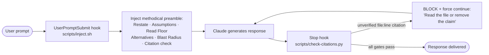

<div align="center">


# Bob

**Measure twice, cut once. Methodical-mode guardrails that keep Claude's ad-hoc work plumb, level, and true.**

[](../../LICENSE)
[](.claude-plugin/plugin.json)
[](https://docs.claude.com/en/docs/claude-code)

</div>

> Bob injects a methodical pre-response checklist into every turn and mechanically enforces it at the Stop hook — catching the confident-wrong citations, hedge-laundered claims, and racing that CLAUDE.md and memory rules quietly miss.
>
> **Drew draws it. Mason builds it. Bob keeps it plumb.**

---

## ✨ What It Does

Most ad-hoc work with Claude races: read a few files, install a package, edit a few more, declare done — then you find it ignored the rate limiter you already had and silently broke a test. CLAUDE.md and memory don't fix it because they're passive. Bob fixes it at the runtime, not the prompt.

- **Methodical-mode preamble** — an always-on `UserPromptSubmit` hook prepends a checklist to every turn: Restate, Verified/Unverified assumptions, Read Floor, Approach Deliberation, Blast Radius, Stall Check, Competing Hypotheses, Goal-Driven Execution, See It Through, Observation Grounding.
- **Five Stop-hook gates** — a file:line citation verifier, an uncertainty-tell scanner, a Fable-mode completion gate (blocks responses that end by promising work without doing it), a zero-tool-call grounding audit, and an iterative two-tier critic dialog.
- **Fable mode** — the See-It-Through preamble plus the completion gate make Claude *do* the next step instead of handing back a plan it was one tool call from finishing — the procedural half of what makes a model feel relentless. Toggle with `/bob:fable-off`.
- **Two-tier critic ladder** — Haiku fast-critic for rounds 1-3, Opus pre-stop-critic for rounds 4-6, HARD block at round 6 until a `/bob:trust-me` bypass. Each round runs a 10-item rule-compliance audit and sees the prior round's feedback.
- **Independent toggles** — each gate has its own switch, so you can silence the preamble while the citation verifier keeps enforcing, or vice versa.
- **Heavier passes on demand** — `/bob:deep` for a structured analysis pass, `/bob:second-opinion` for an independent fresh-context critique.

---

## 🚀 Install

```bash
claude plugin marketplace add gshepptech/bits-and-mortar
claude plugin install bob@bits-and-mortar
```

After install, every new conversation runs methodical-mode by default. No further setup. Commands live under the `/bob:*` namespace.

---

## 🧩 How It Works



**The preamble shapes the response; the Stop hook verifies it.** The `UserPromptSubmit` hook fires before Claude sees your message, prepending the methodical checklist. The `Stop` hook fires when Claude finishes, running five gates — including a citation verifier that cross-checks every `path/to/file.ext:NUMBER` claim against this turn's `Read`/`Grep` calls, and a completion gate that bounces back any response ending in a promise of work Claude didn't do. Subagent (Task / Agent) reads do **not** count as verification, since their internal reads happen in a separate context — that is the failure mode Bob catches.

### Commands

| Command | Effect |
|---|---|
| `/bob:status` | Show current state of all hooks |
| `/bob:on` | Re-enable the methodical-mode preamble for this session |
| `/bob:off` | Silence the preamble for the rest of this session |
| `/bob:casual` | Skip the preamble for the **next single turn** — auto-reverts |
| `/bob:citations-on` | Enable the Stop-hook citation verifier (default) |
| `/bob:citations-off` | Disable the citation verifier |
| `/bob:uncertainty-on` | Enable the uncertainty-tell scanner (default) |
| `/bob:uncertainty-off` | Disable the uncertainty-tell scanner |
| `/bob:strict-on` | Enable the strict gates (grounding audit + critic-agent gate) |
| `/bob:strict-off` | Disable the strict gates |
| `/bob:fable-on` | Enable the completion gate — see-it-through (default) |
| `/bob:fable-off` | Disable the completion gate |
| `/bob:trust-me` | One-shot bypass of the strict gates for the **next single turn** |
| `/bob:help` | Inline reference |

The gates have **independent toggles** — different problems, different switches.

### `/bob:deep` — when the preamble isn't enough

For non-trivial, ambiguous, or architectural tasks, `/bob:deep` runs a heavier read-only pass through seven structured steps: Restate, Assumptions (≥5, each verified or asked), Prior art, Alternatives (≥3 with tradeoffs), Edge cases, Recommend, and Stop-points. Output is a written analysis — **zero code changes**.

### `bob:second-opinion` — independent critique

A subagent with **no prior conversation context**. Spawn it via the Agent tool for a take from a Claude that hasn't anchored on your framing. Returns a written critique with Agreements, Disagreements (with code citations), Missed considerations, an Alternative approach, and a Verdict (`CONCUR` / `CONCUR WITH CAVEATS` / `PUSH BACK` / `WRONG SHAPE`).

---

## ⚙️ Configuration

### State files

Bob keeps small marker files under `~/.claude/`; the hooks read them before firing, and the toggle commands write or delete them. No daemons, no background state.

| File | Controls |
|---|---|
| `~/.claude/.bob-state` | Methodical-mode preamble (absent = on, `off`, `casual`) |
| `~/.claude/.bob-citations-mode` | Citation verifier (absent/`default` = on, `off`) |
| `~/.claude/.bob-uncertainty-mode` | Uncertainty-tell scanner |
| `~/.claude/.bob-strict-mode` | Strict gates (grounding audit + critic-agent gate) |
| `~/.claude/.bob-fable-mode` | Completion gate (absent/`default` = on, `off`) |
| `~/.claude/.bob-trust-me` | One-shot strict bypass for the next turn |
| `~/.claude/.bob-citations-log.jsonl` | Append-only log of every citation check, for tuning |

### Tuning

- **The preamble** — `scripts/inject.sh`. Soften, sharpen, or shorten to taste.
- **The citation regex** — `scripts/check-citations.py`. `CITATION_RE` and `CODE_EXT` are the dials.
- **False-positive log** — tail `~/.claude/.bob-citations-log.jsonl` after real use; blocks against correct citations are signals to refine the regex.

### Tests

```bash
python3 plugins/bob/tests/test_check_citations.py
```

13 cases cover clean responses, fenced-block skipping, subagent-only reads (the key failure mode), diff-line markers, bare path mentions, off-mode short-circuit, Grep verification, log-write behavior, and the Fable-mode completion gate (promise-blocks, clarifying-question pass, fable-off pass). All thirteen pass on a clean install.

### Uninstall

```bash
claude plugin uninstall bob@bits-and-mortar
rm -f ~/.claude/.bob-state ~/.claude/.bob-citations-mode ~/.claude/.bob-uncertainty-mode ~/.claude/.bob-strict-mode ~/.claude/.bob-fable-mode ~/.claude/.bob-trust-me ~/.claude/.bob-citations-log.jsonl
```

### What this isn't

- **Not a replacement for plan mode.** Plan mode (`Shift+Tab`) is a constraint that blocks edits; Bob is guidance that shapes the response. They compose.
- **Not a replacement for Drew or Mason.** Those are for spec'd, contracted work. Bob is for the gaps between — the small asks and exploratory bugs.
- **Not a memory system.** Bob doesn't learn — it enforces. Pair it with your CLAUDE.md; Bob is the runtime that makes Claude actually look at it.

---

## 📄 License

Apache-2.0 — see [LICENSE](../../LICENSE). © 2026 gshepptech
