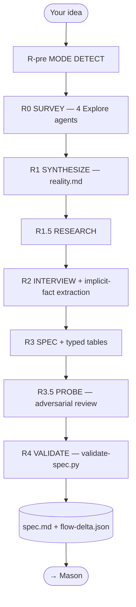

<div align="center">


# Drew

**The codebase-aware specification engine for Claude Code.**

[](../../LICENSE)
[](.claude-plugin/plugin.json)
[](https://docs.claude.com/en/docs/claude-code)

</div>

> Drew runs a grounded specification interview against your existing codebase and seals a citation-backed `spec.md` that Mason can build autonomously. It does not write code — it captures what you actually want, grounds it in what already exists, and locks it into an artifact that survives the trip to the build engine.
>
> **Drew plans. Mason builds.**

---

## ✨ What It Does

Drew surveys your repo in parallel, interviews you adaptively, and emits a typed, classified, citation-backed spec — then seals it with the `SPEC SEALED` sentinel so nothing downstream can quietly mutate intent.

- **Parallel codebase survey** — four Explore agents map architecture, data, surface, and infra before a single question is asked.
- **Grounded interview** — adaptive `AskUserQuestion` flow that captures implicit environmental facts as `A-AUTO-NNN` entries.
- **Typed tables** — every spec carries `## Global Invariants`, `## State Transitions`, and `## Contracts`, each row cited `[from A-NNN]`.
- **Adversarial review** — an R3.5 reviewer reads the draft as a Mason teammate would, flagging ambiguity and missing citations before the seal.
- **Mode detection** — brownfield, greenfield, and cosmetic runs each follow a tuned pipeline; brownfield additionally emits a `flow-delta.json` against the existing system.
- **Mechanical validation** — `validate-spec.py` checks citations, coverage, verbatim Locked-fidelity, and `spec_format_version` frontmatter (v2.1) before exit.

---

## 🚀 Install

```bash
claude plugin marketplace add gshepptech/bits-and-mortar
claude plugin install drew@bits-and-mortar
```

Then run the interview:

```bash
/drew:plan "add rate limiting to the login endpoint"
```

All commands live under the `/drew:*` namespace.

---

## 🧩 How It Works



Brownfield runs add a `flow-mapper` agent before R2 so the interviewer walks you node-by-node through an LSP-anchored graph. Greenfield runs skip flow mapping. Cosmetic runs skip research entirely, going straight from R-pre to R3.

### Phases

| Phase | What it does | Outputs |
|---|---|---|
| **R-pre MODE DETECT** | Classifies the run as `brownfield` / `greenfield` / `cosmetic` and confirms with you | `state.md` mode field |
| **R0 SURVEY** | 4 Explore agents map architecture, data, surface, and infra in parallel | `survey/architecture.md`, `survey/data.md`, `survey/surface.md`, `survey/infra.md` |
| **R1 SYNTHESIZE** | Merges survey outputs into one grounded reality document | `survey/reality.md` |
| **R1.5 RESEARCH** | Targeted online research for library versions, API shapes, common gotchas | inline citations in later stages |
| **R2 INTERVIEW** | Adaptive `AskUserQuestion` interview; brownfield adds flow-graph hop confirmation; **INTV-01** captures implicit facts as `A-AUTO-NNN` | `transcript.md` (answers tagged `A-NNN`) |
| **R3 SPEC** | Writes `spec.md` with typed `## Global Invariants` / `## State Transitions` / `## Contracts` tables (**TYPE-01**); brownfield also writes `flow-delta.json` | `spec.md`, optional `flow-delta.json` |
| **R3.5 PROBE** | Adversarial reviewer (**PROBE-01**) flags ambiguity, missing citations, contradictory `[from A-NNN]` chains | `PROBE-NNN` findings resolved before `SPEC SEALED` |
| **R4 VALIDATE** | `validate-spec.py` mechanically checks references, citations, coverage, verbatim Locked-fidelity, and frontmatter version (**TYPE-02**) | non-zero exit on any failure |

### Commands

| Command | What it does |
|---|---|
| `/drew:plan "<feature description>"` | Run the full interview; produces `spec.md` |
| `/drew:resume` | Pick up an interrupted interview from `state.md` |
| `/drew:cleanup` | Remove all interview state files for a run |
| `/drew:help` | Show plugin help |

### What gets written

```
drew-specs/
└── {feature-slug}/
    ├── spec.md            # The sealed spec
    ├── transcript.md      # Every answer, tagged A-NNN
    ├── state.md           # Mode + spec_type + cohort metadata
    ├── flow-delta.json    # brownfield runs only — packet-derived hops
    └── survey/
        ├── reality.md
        ├── architecture.md
        ├── data.md
        ├── surface.md
        └── infra.md
```

The `spec.md` carries `spec_format_version: v2.1` frontmatter, three typed tables (every row cited `[from A-NNN]`), tagged requirements (`A-NNN`, `US-NNN`, `FR-NNN`, `NFR-NNN`, `AC-NNN`, `GI-NNN`, `ST-NNN`, `CT-NNN`), a `Locked` / `Flexible` / `Informational` classification per item, and a verbatim transcript appendix that Locked items must quote.

---

## ⚙️ Configuration

Run the offline test suite:

```bash
cd plugins/drew && uvx pytest
```

The synthetic-fixture suite covers INTV-01, TYPE-01, TYPE-02, and PROBE-01.

### Why Drew does not build

The split is load-bearing. An interviewer that also writes code is biased toward asking questions whose answers it knows how to implement. By handing the spec to a different process across a frozen boundary, Drew asks questions about *your actual problem* instead. What Drew writes is what Mason reads, byte for byte — every `[from A-NNN]` citation, every `Locked:` quote, every typed-table row survives the trip.

---

## 📄 License

Apache-2.0 — see [LICENSE](../../LICENSE). © 2026 gshepptech
