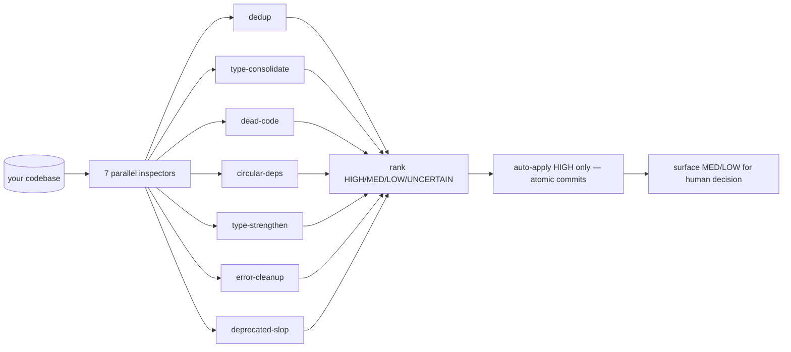

<div align="center">


# Dusty

**The crew member who sweeps the site clean — careful, low-risk codebase cleanup across 7 focused tracks.**

[](../../LICENSE)
[](.claude-plugin/plugin.json)
[](https://docs.claude.com/en/docs/claude-code)

</div>

> Part of the **Bits & Mortar** crew. Dusty sweeps the codebase across 7 cleanup tracks in parallel, ranks every proposed change by confidence, and auto-applies only the HIGH-confidence LOW-risk subset — running type checks, tests, and lints after each batch, with atomic commits so any regression is one `git revert` away.

---

## ✨ What It Does

Machines are great at finding and ranking, terrible at judgement calls. So the machine finds and ranks; the human handles judgement. HIGH-only auto-apply keeps the bot honest, atomic commits keep regressions cheap, and refusing dirty trees keeps blame clean.

- **7 parallel tracks** — dedup, type-consolidate, dead-code, circular-deps, type-strengthen, error-cleanup, deprecated-slop.
- **Confidence gate** — HIGH auto-applies; MEDIUM, LOW, and UNCERTAIN surface for explicit human decision.
- **Verified batches** — type checks, tests, and lints run after every batch; a failing check reverts the batch automatically.
- **Atomic commits** — one revertable commit per batch, never a 200-file mega-commit.
- **Dry-run by default** — applying changes is opt-in; `--auto` skips the apply checkpoint but **never** the HIGH-only gate.
- **Guardrails first** — never merges code that just *looks* similar, never removes dynamically-referenced code, never strips boundary types, never silences real errors, never treats comments as the source of truth.

---

## 🚀 Install

```bash
claude plugin marketplace add gshepptech/bits-and-mortar
claude plugin install dusty@bits-and-mortar
```

Then run a dry-run pass:

```bash
/dusty:run
```

All commands live under the `/dusty:*` namespace.

---

## 🧩 How It Works



Each track inspects read-only, writes a critical assessment, ranks its proposals, and auto-applies only the HIGH-confidence LOW-risk subset.

### The 7 tracks

| Track | Looks for | Example HIGH-confidence change |
|---|---|---|
| **dedup** | Functions/components/utilities that do the same thing | Two identical `formatDate(d)` implementations → keep one, point all callers at it |
| **type-consolidate** | Same-shape interfaces declared in N places | Three local `type User` definitions → one shared in `types/user.ts` |
| **dead-code** | Unreferenced exports, unused params, unreachable branches | A `legacyHandler` no callsite has touched since 2024 |
| **circular-deps** | Import cycles that hurt build perf + clarity | `a → b → a` resolved by extracting the shared piece to `c` |
| **type-strengthen** | `any` / `unknown` / overly-wide signatures with obvious narrower replacements | `userId: any` → `userId: string` once all callsites prove it |
| **error-cleanup** | `catch {}` that swallows, `throw new Error('TODO')` left behind | Empty catches → log + rethrow |
| **deprecated-slop** | Stale `@deprecated`, commented-out blocks, AI-pattern boilerplate | Stale `TODO` boilerplate comments that never got resolved |

### Confidence gate

| Rank | Behavior |
|---|---|
| **HIGH** | Verified safe by static analysis + tests. Auto-applies in `--apply` or `--auto` mode. |
| **MEDIUM** | Likely safe but has at least one judgement call. Surfaces for human decision. |
| **LOW** | Risky or context-dependent. Surfaces with caveat. |
| **UNCERTAIN** | Needs domain knowledge Dusty does not have. Surfaces only. |

`--auto` skips the apply checkpoint but never the HIGH gate. MEDIUM and LOW always need explicit human acknowledgement.

### Commands

| Command | What it does |
|---|---|
| `/dusty:run` | Default `--dry-run`. Runs all 7 inspectors, produces assessments, applies nothing. |
| `/dusty:run --apply` | Presents HIGH-confidence changes, **stops at a checkpoint** before applying. |
| `/dusty:run --auto` | Auto-applies HIGH changes batch by batch with no checkpoint. Still gates MED/LOW. |
| `/dusty:run --tracks=dedup,dead-code` | Restrict to specific tracks (default: all 7). Accepts names or numbers (`--tracks=1,3,5`). |
| `/dusty:apply` | Apply changes from a prior `--dry-run` assessment. |
| `/dusty:status` | Show the state of the current/last run. |
| `/dusty:help` | Plugin help. |

### What gets written

```
your-repo/
├── (your code, with HIGH-confidence cleanups applied)
└── .dusty/
    └── runs/<run-id>/
        ├── assessment-dedup.md
        ├── assessment-type-consolidate.md
        ├── ... (one per track)
        ├── decisions.md        # MED/LOW items needing human input
        └── log.md              # batch-by-batch run log
```

Each batch is an atomic git commit, revertable individually:

```
chore(dusty): remove 3 unused exports

- `legacyHandler` from src/api/handlers.ts (last referenced 2024-08)
- `oldFormatter` from src/util/format.ts (no static or dynamic references)
- `_internalCheck` from src/auth/session.ts (replaced by checkSession in #1248)

Verified: npm test + typecheck pass.
```

---

## ⚙️ Configuration

### Guardrails

Dusty will **NOT**:

- Merge code that just **looks** similar — behavior must be byte- or AST-equivalent.
- Remove dynamically-imported / config-referenced / framework-convention / generated code, even with no static callsite.
- Strip legitimate boundary types — JSON parses, external APIs, FFI, and deserialization stay typed as the real shape.
- Silence real error boundaries — empty catches are *fixed*, not removed.
- Introduce new abstractions just to break a cycle — it would rather report the cycle.
- Use comments as the source of truth — if a comment and the code disagree, the code wins.
- Run on a **dirty working tree** — it refuses to start unless `git status` is clean.

### Prerequisites

- A git repository — atomic commits are the safety mechanism, so Dusty refuses to run outside one.
- A clean working tree — stash or branch first.
- Language tooling on `PATH` — Dusty detects and uses whatever fits (TypeScript: `tsc`, `eslint`; Python: `mypy`, `ruff`; Go: `go vet`, `staticcheck`; etc.).

### When to run it

- **Before a release** — clear obvious cruft, surface MED/LOW for the next sprint.
- **After a feature merge** — peel off the easy wins the feature exposed.
- **As periodic maintenance** — `/dusty:run --auto --tracks=dead-code,deprecated-slop` on a weekly cron.
- **Before a refactor** — scope to the area you are about to touch, apply HIGH, then refactor.

Do not run it as a deadline panic measure — the MED/LOW review takes real time and should not be rushed.

---

## 📄 License

Apache-2.0 — see [LICENSE](../../LICENSE). © 2026 gshepptech
