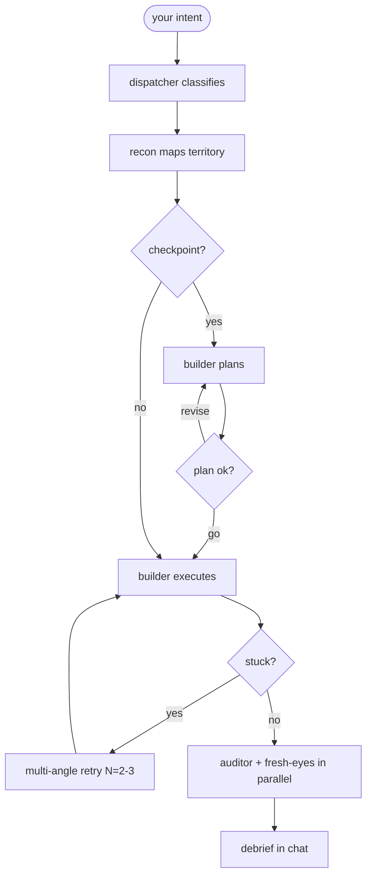

<div align="center">

# Gus

**Hand Gus a gnarly problem — he owns the outcome end to end.**

[](.claude-plugin/plugin.json)
[](../../LICENSE)
[](https://docs.claude.com/en/docs/claude-code)

</div>

> Gus is the general contractor. He runs a crew of five Opus sub-agents — dispatcher, recon, builder, auditor, fresh-eyes — that investigate, plan, execute, and verify a free-form intent end to end. You hand Gus the problem; he owns the outcome and comes back with an evidence ledger.

---

## ✨ What It Does

Gus takes a free-form intent and runs it to completion. His crew of five Opus sub-agents collaborates: the **builder** SSHes into hosts, runs `terraform`, edits code, kicks deploys, debugs airgap bundles — self-switching between **investigating → planning → executing → verifying** as the work evolves. The **auditor** and **fresh-eyes** then verify the result, each forced to produce a real **evidence ledger** of commands they actually ran.

The guarantee: nothing ships on inference. `--yolo` agents that skip verification get you 60% of the way before silently breaking the last 40%. Gus refuses to call it done without two independent verifiers — and **fresh-eyes reads only the intent and the current state of the code**, never the builder's notes, so it catches the "the builder convinced itself it worked" failure mode. Production beats yolo, always.

---

## 🚀 Install

```bash
claude plugin marketplace add gshepptech/bits-and-mortar
claude plugin install gus@bits-and-mortar
```

Then drive it with the `/gus:*` commands:

```
/gus:goal every test in test/auth passes and `npm run lint` exits 0
```

---

## 🧩 How It Works



- **Dispatcher** classifies the intent: mode (`investigating` / `planning` / `executing`), tier (`quick` / `standard` / `thorough`), side effects (`none` / `local` / `remote` / `production`), and whether a checkpoint is required.
- **Recon** spends a bounded budget mapping the problem — 30 tool calls / 6 minutes (doubled under `--thorough`).
- **Builder** is one persona that self-switches modes as it works. Not five different agents — one agent that knows when to change gears.
- **Auditor + fresh-eyes verify in parallel.** Auditor reads the brief, plan, and journal. Fresh-eyes reads only the intent and current code state — its job is to catch what the builder convinced itself of.
- **Multi-angle retry** fires when the builder declares `stuck`: N=2-3 variants run in parallel with different framings (config vs environment vs permissions); an arbiter picks the most productive framing and the builder resumes.

### Commands

| Command | What it does |
|---|---|
| `/gus:do "<intent>" [--thorough] [--yolo] [--scope=quick\|standard]` | Run the full investigate → plan → execute → verify flow on a free-form intent, with one plan checkpoint for side-effecting work |
| `/gus:goal "<condition>" [--max-cycles=N] [--max-hours=N] [--allow-production] [--thorough]` | Set a completion condition and run the builder → auditor → fresh-eyes loop unattended until both verifiers pass — enforced by a `Stop` hook, bounded by cycle and time caps |
| `/gus:resume [<run-id>]` | Resume an interrupted run from `.gus/runs/<run-id>/` |
| `/gus:list [--all\|--active\|--completed]` | List recent runs |
| `/gus:cancel [<run-id>]` | Cancel an in-flight run |
| `/gus:help` | Plugin help |

### Checkpoints — when Gus asks before doing

`/gus:do` asks for plan approval **once** if any of these are true: the initial mode is `planning`, the side effects are `remote` (SSH, kubectl, terraform) or `production`, and you did not pass `--yolo`. For pure investigation (`side_effects: none`) it runs end to end with no checkpoint. **Production beats yolo** — `--yolo` is silently overridden when production is in scope.

---

## ⚙️ Configuration

### `.gus/hosts.yml` (optional)

Tag your hosts so the dispatcher can detect production scope:

```yaml
hosts:
  staging:
    ssh: ubuntu@staging.example.com
    tags: [dev, azure, rhel]
  prod:
    ssh: deploy@prod.example.com
    tags: [production, azure, rhel]
```

Production-tagged hosts force plan approval regardless of flags.

### Run artifacts

Each run writes to `.gus/runs/<run-id>/`:

```
.gus/runs/gus-20260518-141522-a3f4/
├── state.json              # status, phase, timestamps — drives /gus:resume
├── dispatcher-config.json
├── brief.md                # recon's territory map
├── plan.md                 # builder's plan (if checkpoint)
├── journal.md              # builder's progress notes
├── reflections.md          # builder's mode-switch reasoning
├── verification.md         # builder's self-check
├── auditor-verdict.md      # auditor's evidence ledger
├── fresh-eyes-verdict.md   # fresh-eyes' independent ledger
├── followups.md
└── retry/                  # only if multi-angle retry fired
    ├── variant-A/
    ├── variant-B/
    ├── variant-C/
    └── synthesis.md
```

Plan and debrief render in chat — you never have to open these. They exist for resume and audit.

> **Unattended runs:** an unattended `/gus:goal` run can't survive an interactive block, so it refuses to start unless the `bob` plugin's strict gates are off. Run `/bob:strict-off` first if you use bob.

---

## 📄 License

Apache-2.0 — see [LICENSE](../../LICENSE). © 2026 gshepptech
