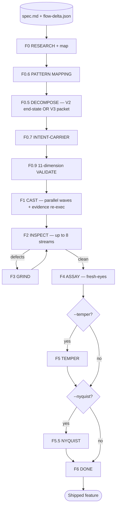

<div align="center">


# Mason

**The builder on the Bits & Mortar crew — an autonomous build-verify-fix loop for Claude Code.**

[](../../LICENSE)
[](.claude-plugin/plugin.json)
[](https://docs.claude.com/en/docs/claude-code)

</div>

> Mason takes Drew's spec and runs an autonomous build-verify-fix loop until the feature ships. No approval gates, no "is this what you wanted?" checkpoints — it decomposes the spec into castings, dispatches teammate prompts verbatim, runs up to eight parallel verification streams, grinds defects to zero, then assays the result with fresh eyes.
>
> **Drew draws it. Mason builds it.**

---

## ✨ What It Does

The discipline is the product. Every mechanism in Mason exists to keep the spec intact across the build.

- **Spec-driven decomposition** — reads Drew's spec, authors per-casting teammate prompts once, then dispatches them byte-identically.
- **11-dimension validation** — an M0.9 gate (including M0.7 intent-carrier coverage) blocks the build until decomposition is sound.
- **Parallel wave building** — castings build in waves with server-side evidence re-execution bound to specific requirement IDs.
- **Up to 8 verification streams** — TRACE, FLOW_TRACE, PROVE, RESEARCH_AUDIT, COVERAGE_DIFF, SIGHT, TEST/PROBE, TEST_OBSERVATIONS.
- **Grind to zero** — every defect routes back through GRIND, then re-inspects fully before advancing.
- **Fresh-eyes assay** — four parallel assayer agents verify the build against the original spec, spec-before-code.
- **Mode-aware** — brownfield runs consume a flow delta; greenfield and cosmetic runs use the end-state pipeline.

---

## 🚀 Install

```bash
claude plugin marketplace add gshepptech/bits-and-mortar
claude plugin install mason@bits-and-mortar
```

Mason needs its MCP server wired in once per project:

```bash
/mason:setup
```

Then start a build from a sealed spec:

```bash
/mason:start "ship login rate limiting" --spec blueprint-specs/rate-limit/spec.md
```

All commands live under the `/mason:*` namespace.

---

## 🧩 How It Works



### Phases

| Phase | What it does | Key tools |
|---|---|---|
| **F0 RESEARCH** | Per-domain `researcher` agents (parallel); optional `codebase-mapper` extracts `MANDATORY_RULES.md` | `Mill-Init` |
| **F0.6 PATTERN** | `pattern-mapper` finds analog files for every spec target; emits `PATTERNS.md` | — |
| **F0.5 DECOMPOSE** | Authors casting manifest + per-casting prompts; **V2 end-state** or **V3 packet** mode | `Mill-Spawn-Teammate` |
| **F0.7 INTENT-CARRIER** | Verifies every `A-NNN` answer survives into a casting prompt; `INTENT_DROPPED` blocks F0.9 | `Mill-Intent-Coverage` |
| **F0.9 VALIDATE** | 11-dimension mechanical gate; verifies byte-identical block propagation | `Mill-Validate-Castings` |
| **F1 CAST** | Parallel wave building; re-runs cited evidence server-side, binds to requirement IDs | `Mill-Cast-Wave`, `Mill-Accept-Casting` |
| **F2 INSPECT** | Up to 8 parallel verification streams (below) | `Mill-Sync` |
| **F3 GRIND** | Defects → casting-scoped tasks → fix → re-inspect | `Mill-Tasks`, `Mill-Fix` |
| **F4 ASSAY** | Four parallel `assayer` agents; spec-before-code | `Mill-Verdict` |
| **F5 TEMPER** | Optional (`--temper`) — micro-domain stress testing | `Mill-Stream` |
| **F5.5 NYQUIST** | Optional (`--nyquist`) — regression test generation | `Mill-Stream` |
| **F6 DONE** | Shut down teammates, generate report, mark `done` | `Mill-Phase("done")` |

### F2 INSPECT streams

| Stream | What it verifies | When it runs |
|---|---|---|
| **TRACE** | Upstream wiring: EXISTS → SUBSTANTIVE → WIRED → PLACED | Always |
| **FLOW_TRACE** | Downstream wiring: PRODUCED → CONSUMES_UPSTREAM → SUBSTANTIVE → CHAIN_INTACT | Brownfield (`flow-delta.json` present) |
| **PROVE** | Spec-to-code citation verification with stub detection | Always |
| **RESEARCH_AUDIT** | Code honours every F0 research recommendation | When research findings or Informational items exist |
| **COVERAGE_DIFF** | 1:1 source → destination symbol check | MIGRATION specs only |
| **SIGHT** | Browser-based UI audit via Playwright | When the spec describes UI behavior |
| **TEST / PROBE** | Full test suite + API smoke | Always |
| **TEST_OBSERVATIONS (TEST-01)** | Spec-only Hypothesis test derivation from the `## Contracts` table, run code-blind | When spec is `>= v2.1` and `## Contracts` is non-empty |

Zero defects → F4. Any defect → F3 → F2 → F4 (full re-verify after every fix).

### Commands

| Command | What it does |
|---|---|
| `/mason:setup` | Install MCP server + verify Python prerequisites |
| `/mason:start "<scope>" --spec PATH` | Start a build-verify-fix loop |
| `/mason:status` | Show current run status |
| `/mason:resume` | Resume an interrupted run |
| `/mason:stop` | Gracefully stop the current run |
| `/mason:help` | Show plugin help |

`/mason:start` flags:

| Flag | Effect |
|---|---|
| `--spec PATH` | Spec file (required) |
| `--url URL` | Run against a URL surface |
| `--temper` | Enable F5 TEMPER stress testing |
| `--nyquist` | Enable F5.5 NYQUIST regression test generation |
| `--max-cycles N` | Cap GRIND cycle count |
| `--no-ui` | Suppress orchestrator banners |
| `--output-dir DIR` | Override `mill-archive/` location |

### What every casting prompt carries

The drift-prevention blocks — frozen and byte-identical across the run, seen by every teammate:

```markdown
<mandatory_rules>           # CLAUDE.md / AGENTS.md / .cursorrules verbatim
<global_invariants>         # cross-cutting spec rules
<invariants>                # spec ## Global Invariants table — TYPE-01
<state_transitions>         # spec ## State Transitions table — TYPE-01
<contracts>                 # spec ## Contracts table — TYPE-01
<spec_requirements>         # this casting's spec slice (V2 only)
<analog_pattern>            # F0.6 pattern excerpts
<shared_patterns>           # F0.6 cross-cutting patterns
```

In V3 packet mode, `<spec_requirements>` is replaced by `<upstream_anchor>`, `<prerequisite_hops>`, `<this_hop>`, `<downstream_contract>`, and `<self_check>`. The teammate sees only the hop contract — no end-state framing — which is V3's reversal of endpoint-anchored plumbing hallucination.

---

## ⚙️ Configuration

### MCP server

The `mcp-server/` directory ships a Python MCP server (`mill-mcp`) that backs every Lead-side tool call. Without it the slash command loads but the workflow cannot drive. Wire it in once:

```bash
claude mcp add mill -- uvx --from "git+https://github.com/gshepptech/bits-and-mortar#subdirectory=plugins/mason/mcp-server" mill-mcp --project-root .
```

The server stores all run state under `mill-archive/{run}/` in your project — castings, prompts, defects, handoffs, reports, every acceptance check. A full audit trail per build.

### Tests

```bash
cd plugins/mason/mcp-server && uvx pytest
```

Current baseline: **81 passed** (synthetic-fixture suite covering every MCP tool's parsers, schemas, and handoff state).

### Why Mason does not interview

The split is load-bearing. A builder that also interviews is biased toward designing castings whose shape it knows how to ship. A builder consuming a frozen spec just *implements what the spec says*. What Drew writes is what Mason reads, byte for byte — every `[from A-NNN]` citation, every `Locked:` quote, every typed-table row, every implicit-fact tag survives the trip.

---

## 📄 License

Apache-2.0 — see [LICENSE](../../LICENSE). © 2026 gshepptech
