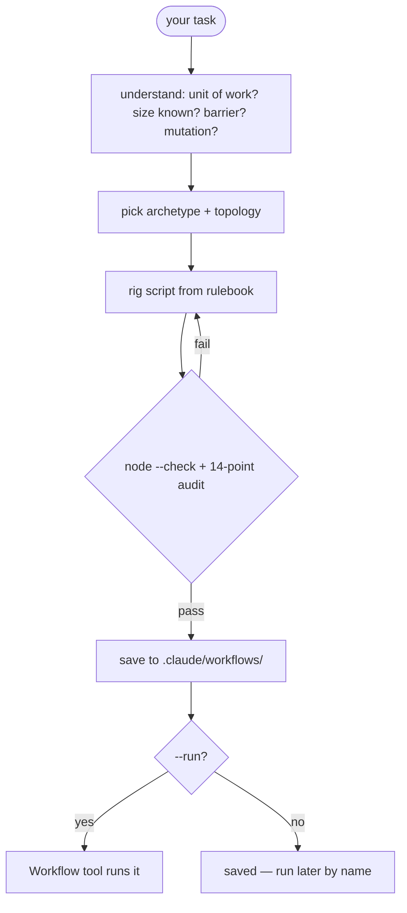

<div align="center">

# Riggs

**You name the task. Riggs picks the topology, rigs up the script, and validates it.**

[](.claude-plugin/plugin.json)
[](../../LICENSE)
[](https://docs.claude.com/en/docs/claude-code)

</div>

> An on-demand generator for Claude's Workflow tool. Writing a *good* Workflow script is mostly knowing the rules — Riggs rigs them into a generator, then validates everything it produces before you run it.

---

## ✨ What It Does

The Workflow tool is Claude's dynamic multi-agent orchestrator — it fans out subagents via `agent()`, `pipeline()`, `parallel()`, and budget-driven loops. Writing a good script for it is mostly knowing the hard rules. Riggs knows them.

`/riggs:make <task>` classifies the task into an orchestration archetype, picks the right fan-out topology (pipeline by default; a barrier only when a stage genuinely needs all prior results), authors a self-contained Workflow script that obeys the Workflow tool's hard rules, runs `node --check` and a **14-point self-audit** against it, and saves it to `.claude/workflows/`.

Riggs rigs up the orchestration so you don't freehand it.

---

## 🚀 Install

```bash
claude plugin marketplace add gshepptech/bits-and-mortar
claude plugin install riggs@bits-and-mortar
```

Then rig up a script with the `/riggs:*` commands:

```
/riggs:make review the current diff for bugs and prove each finding is real
```

---

## 🧩 How It Works



The generator's bias matches the Workflow tool's own: **`pipeline()` by default, a barrier only when one stage genuinely needs all prior results.** Most "separate stages" are pipelines, not barriers — Riggs refuses to barrier without a named cross-item dependency.

### Commands

| Command | What it does |
|---|---|
| `/riggs:make <task> [--run] [--save=<name>] [--args=<json>]` | classify → shape → rig → validate → save (and run with `--run`) |
| `/riggs:help` | Usage guide |

### The archetypes

| Archetype | Shape |
|---|---|
| **understand** | parallel readers per subsystem → one synthesis (barrier justified) |
| **design** | N approaches from different angles → judge panel → synthesize winner |
| **review** | dimensions in a pipeline, each finding adversarially verified as it lands |
| **research** | multi-modal sweep → deep-read → verify claims → cited synthesis |
| **migrate** | discover sites → transform each in a worktree → verify |
| **generic** | loop-until-dry / loop-until-budget for unknown-size work |

Compose freely — they're starting points, not a fixed menu.

### What makes a script "good" (the rules Riggs enforces)

- **Pure-literal `meta`** — no computed values in the literal, phase titles matched.
- **Pipeline by default** — `parallel()` only for a justified barrier (dedup, early-exit, cross-item compare).
- **`schema` for structured returns** — never `JSON.parse` agent text.
- **`.filter(Boolean)`** every fan-out result (skipped/thrown agents are `null`).
- **`isolation:'worktree'` only for parallel file mutation** — it's expensive.
- **Budget loops guarded on `budget.total`** — else they run to the agent cap.
- **No `Date.now()` / `Math.random()`** — they break resume and throw.
- **No silent caps** — any top-N / sampling is `log()`-ged.

Every generated script passes `node --check` and a 14-point self-audit before it's shown as done. The full procedure lives in [`references/rulebook.md`](references/rulebook.md).

---

## ⚙️ Configuration

Running is opt-in. A workflow can spawn dozens of agents and burn a lot of tokens, so `/riggs:make` **rigs and saves** by default and only **runs** when you pass `--run` or tell it to. Saved scripts live in `.claude/workflows/` and are parameterized over `args`, so they're reusable across runs — run now, run later by name, or edit and re-run (or resume a paused run with `{scriptPath, resumeFromRunId}`).

---

## 📄 License

Apache-2.0 — see [LICENSE](../../LICENSE). © 2026 gshepptech
