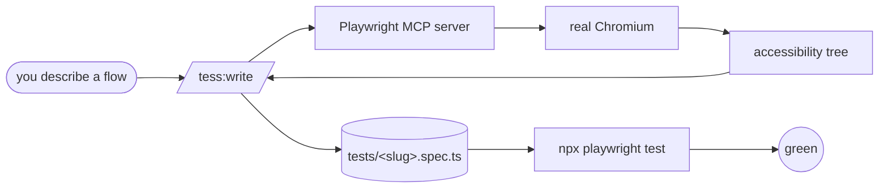

<div align="center">


# Tess

**Describe the flow. Tess walks every room. The spec writes itself.**

[](.claude-plugin/plugin.json)
[](../../LICENSE)
[](https://docs.claude.com/en/docs/claude-code)

</div>

> End-to-end test authoring and maintenance for web apps. Claude opens a real browser via Playwright MCP, reads the accessibility tree, performs the clicks itself, and emits a passing `*.spec.ts` — then keeps it passing.

---

## ✨ What It Does

End-to-end tests are valuable, and writing them is tedious — you click around the app yourself, hand-write selectors, debug locators that didn't match, then maintain them when buttons get renamed. Tess replaces the annoying part: tell her a flow in plain English, get a passing spec.

The trick is the **accessibility tree**: every `browser_snapshot` returns the same role+name structure Playwright will use at runtime. What Claude sees ≡ what the test will see, so selectors don't drift between authoring and execution. Non-trivial flows delegate to the `tess:spec-writer` subagent so MCP snapshot noise stays out of the main context.

---

## 🚀 Install

```bash
claude plugin marketplace add gshepptech/bits-and-mortar
claude plugin install tess@bits-and-mortar
```

Then scaffold a project and author your first test with the `/tess:*` commands:

```bash
/tess:init
# Restart Claude Code so the Playwright MCP server's tools load.
# Start your dev server (npm run dev, etc.) first.

/tess:write user signs up with email, verifies the magic link, lands on the dashboard
/tess:crawl     # bulk smoke coverage
/tess:audit     # maintain
```

**Prereqs:** Node.js 18+; a reachable dev server at the `baseURL` in `playwright.config.ts` (default `http://localhost:3000`); and a **Claude Code restart after `/tess:init`** so the Playwright MCP server's tools load — without it, `/tess:write` has nothing to drive.

---

## 🧩 How It Works



For each flow:

1. `browser_navigate` to the start URL.
2. `browser_snapshot` returns the accessibility tree (roles + accessible names + structure).
3. Claude picks the element by role+name and calls the matching MCP tool (`browser_click`, `browser_type`, `browser_select`, etc.).
4. Snapshot again, confirm the DOM changed, capture the post-state for assertions.
5. Emit `tests/<slug>.spec.ts`, run it, retry up to 4 times if selectors miss.

### Commands

| Command | When to run | What it does |
|---|---|---|
| `/tess:init` | Once per project | Installs Playwright, scaffolds `playwright.config.ts` + `tests/`, registers the Playwright MCP server |
| `/tess:write "<flow>"` | Each new feature/flow | Drives the browser and emits a green `.spec.ts` |
| `/tess:crawl` | Once at start | Discovers every route and emits a smoke spec per route |
| `/tess:matrix` | When you have role-based access | Generates a routes × roles coverage suite with reused `storageState` |
| `/tess:audit` | After changes / pre-merge | Runs the suite, reads `trace.zip` per failure, triages by root cause (`--fix` proposes patches, stops to ask before applying) |
| `/tess:record` | Rare (OAuth, 2FA, payments) | Wraps `playwright codegen` for manual capture |
| `/tess:help` | Anytime | Plugin help |

### What the plugin enforces

- **Selectors:** `getByRole`, `getByLabel`, `getByText`. CSS selectors and XPath require an inline comment justifying the exception.
- **Waits:** no `page.waitForTimeout(ms)`. Auto-wait via `await expect(locator).toBeVisible()` or `.toHaveText()`.
- **Idempotency:** each `test()` is self-contained. No "this test depends on the previous one."
- **Trace-driven debugging:** when a test fails twice, the trace at `test-results/<test>/trace.zip` is the source of truth, not stack traces.

These rules live in `skills/author/SKILL.md` (authoring) and `skills/diagnose/SKILL.md` (triage); both skills auto-load with the relevant commands.

---

## ⚙️ Configuration

Files written to disk:

```
your-project/
├── playwright.config.ts          # from /tess:init
├── .mcp.json                     # contains the Playwright MCP entry
├── tests/
│   ├── signup-*.spec.ts          # from /tess:write
│   ├── smoke-*.spec.ts           # from /tess:crawl
│   └── matrix-*.spec.ts          # from /tess:matrix
├── test-results/                 # Playwright run artifacts (gitignored)
├── playwright-report/            # HTML report (gitignored)
└── .auth/                        # cached storageState per role (gitignored)
```

This plugin is specifically for the "did the user-facing flow work" question. It is not for unit tests (use Vitest/Jest), API contract tests, or performance/load testing.

---

## 📄 License

Apache-2.0 — see [LICENSE](../../LICENSE). © 2026 gshepptech
